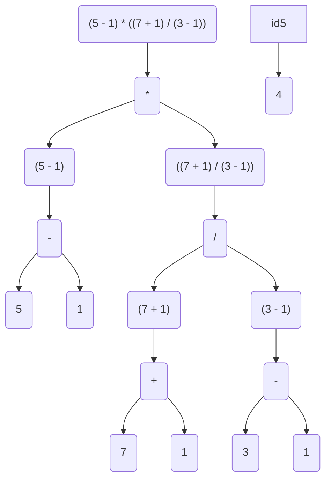

# O Básico de Python

## Console/Terminal

O _console_ ou _terminal_ é um sistema com monitor e teclado para enviar e receber informações do sistema [System Console](https://en.wikipedia.org/wiki/System_console).


A forma mais eficiente[^1] para comandar/programar um computador é ainda via _cli (command line interface)_ que é uma forma de se chamar programas via console.


## Comandos no Terminal

Para comandar um computador via _terminal_ alguns comandos são necessários veja [esse tutorial](https://marquesfernandes.com/self/como-comecar-a-usar-a-linha-de-comando-terminal-no-linux-tutorial-para-iniciantes/) para se familiarizar com os commandos mais comuns.

## Modo Interativo

O interpretador quando chamado sem passar nenhum programa como argumento entra no modo **interativo** ou modo _REPL_ (Read-Evaluate-Print Loop).

Em que ele lê o comando escrito na tela, avalia o resultado, imprime o resultado e volta ao começo.


## Expressões

Uma expressão é uma combinação de _operadores_ e _operandos_ resultando em um _valor_.

```python
>>> 2 + 4 + 7 # Expressão com dois operadores de soma e 3 operandos.
13 # Resultado da expressão
>>> 2**10
1024
>>> 10**2
100
```

### Operadores Matemáticos

| Operador | Nome            | Exemplo  | Resultado |
| -------- | --------------- | -------- | --------- |
| `**`     | Potenciação     | `5**3`   | `125`     |
| `%`      | Módulo          | `5 % 3`  | `2`       |
| `//`     | Divisão Inteira | `5 // 3` | `1`       |
| `/`      | Divisão         | `5 / 3`  | `1.6666`  |
| `*`      | Multiplicação   | `5 * 3`  | `15`      |
| `-`      | Subtração       | `5 - 3`  | `2`       |
| `+`      | Adição          | `5 + 3`  | `8`       |

A ordem de precedência deles é de cima para baixo.
Contudo, podemos usar parenteses para alterar a precedência.

Ou seja:

```python
>>> 5 - 1 * 7 + 1 / 3 - 1
-2.666666666667
```

Enquanto

```python
>>> (5 - 1) * ((7 + 1) / (3 - 1))
16.0
```

A segunda é avaliada sobrepondo as precedências usando os parênteses como se pode ver no esquema abaixo



## Mensagens de Erros

Tentar fazer coisas _proibidas_ pela linguagem resulta em mensagens de erro que podem ser usadas para consertar o código.

```python
>>> 10 +
  File "<stdin>", line 1
    10 +
        ^
SyntaxError: invalid syntax
```

Esse é um erro do tipo `SyntaxError` ele diz na mensagem que a sintaxe usada está errada.
A soma tem que receber dois operandos e no código só teve um.

```python
>>> 1 + * 2
  File "<stdin>", line 1
    1 + * 2
        ^
SyntaxError: invalid syntax
```

Outro erro sintático, pois a soma precisa de dois operandos, o segundo no caso foi um outro operador.

```python
>>> 10 / 0
Traceback (most recent call last):
  File "<stdin>", line 1, in <module>
ZeroDivisionError: division by zero
```

É impossível fazer uma divisão por zero.

> Mensagens de erro podem e devem ser usadas para resolver problemas com o código.

## Tipos `int` (Inteiro), `float` (Ponto-flutuante) e `str` (String)

TODO: escrever texto.

## Concatenação e Repetição/Replicação

TODO: escrever texto.

## Variáveis

TODO: escrever texto.

### Atribuição

TODO: escrever texto.

### Identificadores

TODO: escrever texto.

#### Cuidados Especiais

TODO: escrever texto.

## Um primeiro programa

TODO: escrever texto.

### Comentários

TODO: escrever texto.

### `print()`

TODO: escrever texto.

### `input()`

TODO: escrever texto.

### `len()`

TODO: escrever texto.

### `str()`, `int()`, `float()`

TODO: escrever texto.

## Leitura Recomendada

Veja tutoriais sobre o console [Comand Line For Begginers](https://ubuntu.com/tutorials/command-line-for-beginners#1-overview) ou [Como começar a usar a linha de comando...](https://marquesfernandes.com/self/como-comecar-a-usar-a-linha-de-comando-terminal-no-linux-tutorial-para-iniciantes/)

Leia o restante do capítulo [Python Basics](https://automatetheboringstuff.com/2e/chapter1/) existe a tradução automática do google para páginas inteiras como pode ser visto [clicando aqui](https://automatetheboringstuff-com.translate.goog/2e/chapter1/?_x_tr_sl=auto&_x_tr_tl=pt&_x_tr_hl=en&_x_tr_pto=wapp).

## Créditos

Esse texto foi fortemente inspirado no [Automate The Boring Stuff](https://automatetheboringstuff.com/2e/chapter1/) e também está sob a licença [Creative Commons](https://creativecommons.org/licenses/by-nc-sa/3.0/).

[^1]: Eficiente aqui se refere mais sobre como organizar vários programas que devem se comunicar entre sí do que de fato usuários humanos do sistema.
