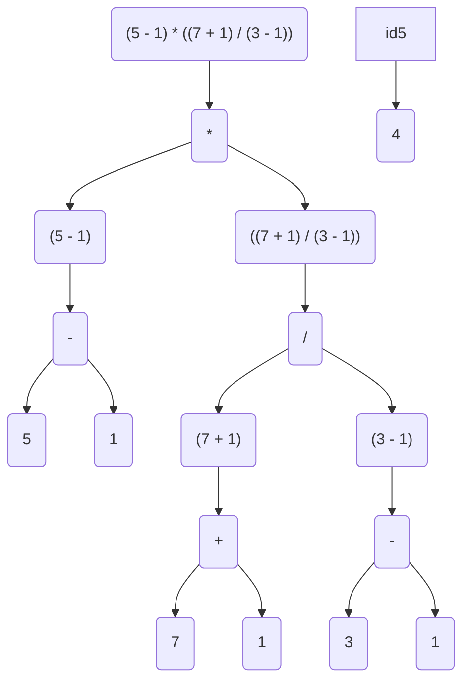

# O Básico de Python

## Console/Terminal

O _console_ ou _terminal_ é um sistema com monitor e teclado para enviar e receber informações do sistema [System Console](https://en.wikipedia.org/wiki/System_console).


A forma mais eficiente[^1] para comandar/programar um computador é ainda via _cli (command line interface)_ que é uma forma de se chamar programas via console.


## Comandos no Terminal

Para comandar um computador via _terminal_ alguns comandos são necessários veja [esse tutorial](https://marquesfernandes.com/self/como-comecar-a-usar-a-linha-de-comando-terminal-no-linux-tutorial-para-iniciantes/) para se familiarizar com os commandos mais comuns.

## Modo Interativo

O interpretador quando chamado sem passar nenhum programa como argumento entra no modo **interativo** ou modo _REPL_ (Read-Evaluate-Print Loop).

Em que ele lê o comando escrito na tela, avalia o resultado, imprime o resultado e volta ao começo.


## Expressões

Uma expressão é uma combinação de _operadores_ e _operandos_ resultando em um _valor_.

```python
>>> 2 + 4 + 7 # Expressão com dois operadores de soma e 3 operandos
13 # Resultado da expressão
>>> 2**10
1024
>>> 10**2
100
```

### Operadores Matemáticos

| Operador | Nome            | Exemplo  | Resultado |
| -------- | --------------- | -------- | --------- |
| `**`     | Potenciação     | `5**3`   | `125`     |
| `%`      | Módulo          | `5 % 3`  | `2`       |
| `//`     | Divisão Inteira | `5 // 3` | `1`       |
| `/`      | Divisão         | `5 / 3`  | `1.6666`  |
| `*`      | Multiplicação   | `5 * 3`  | `15`      |
| `-`      | Subtração       | `5 - 3`  | `2`       |
| `+`      | Adição          | `5 + 3`  | `8`       |

A ordem de precedência deles é de cima para baixo.
Contudo, podemos usar parenteses para alterar a precedência.

Ou seja:

```python
>>> 5 - 1 * 7 + 1 / 3 - 1
-2.666666666667
```

Enquanto

```python
>>> (5 - 1) * ((7 + 1) / (3 - 1))
16.0
```

A segunda é avaliada sobrepondo as precedências usando os parênteses como se pode ver no esquema abaixo



## Mensagens de Erros

Tentar fazer coisas _proibidas_ pela linguagem resulta em mensagens de erro que podem ser usadas para consertar o código.

```python
>>> 10 +
  File "<stdin>", line 1
    10 +
        ^
SyntaxError: invalid syntax
```

Esse é um erro do tipo `SyntaxError` ele diz na mensagem que a sintaxe usada está errada.
A soma tem que receber dois operandos e no código só teve um.

```python
>>> 1 + * 2
  File "<stdin>", line 1
    1 + * 2
        ^
SyntaxError: invalid syntax
```

Outro erro sintático, pois a soma precisa de dois operandos, o segundo no caso foi um outro operador.

```python
>>> 10 / 0
Traceback (most recent call last):
  File "<stdin>", line 1, in <module>
ZeroDivisionError: division by zero
```

É impossível fazer uma divisão por zero.

> Mensagens de erro podem e devem ser usadas para resolver problemas com o código.

Uma lista de todos os tipos de erros/exceções embutidos pode ser visto clicando no link a seguir [documentação oficial erros/exceções](https://docs.python.org/pt-br/3/library/exceptions.html#built-in-exceptions).
Essa lista é bastante extensa e serve mais como referência do que como leitura recomendada.

## Tipos `int` (Inteiro), `float` (Ponto-flutuante) e `str` (String)

Tipos de dados são formas diferentes de _codificar_ informações em binário.

Cada forma de codificar uma informação facilita o uso dessa informação para algumas tarefas enquanto dificulta o uso dela para outras.

Três dos tipos de dados mais comuns são `int` (para codificar valores inteiros), `float` (para codificar números com casas decimais), `str` (para codificar cadeias de caracteres, textos).

```python
>>> 3.14 # Tipo float
3.14
>>> 2 # Tipo int
2
>>> "Aqui é uma cadeia de caracteres" # Tipo str
'Aqui é uma cadeia de caracteres'
```

## Concatenação e Repetição/Replicação

Existem duas operações mais comuns que podem ser feitas com _strings_.

### Concatenação

```python
>>> "Concatenando" + "Várias" + "Strings"
'ConcatenandoVáriasStrings'
```

### Repetição

```python
>>> "Repita!" * 3
'Repita!Repita!Repita!'
```

### Importante

Os mesmos símbolos `+` e `*` são usados nas operações aritméticas e nas operações com strings.

Caso você tente fazer `'Soma com 3' + 3` o interpretador não vai ter como fazer essa operação, pois o símbolo `+` quando usado como concatenação precisa de duas strings e quando usado como soma precisa de dois números, não existe operador `+` que junta uma string com um número.

```python
>>> 'Soma com 3' + 3
Traceback (most recent call last):
  File "<stdin>", line 1, in <module>
TypeError: can only concatenate str (not "int") to str
```

## Variáveis

Variáveis são _caixas_ aonde é possível guardar valores ou resultados de operações para uso futuro.

```python
>>> resultado = 10 # O valor 10 é guardado na variável resultado
>>> resultado + 10
20
>>> resultado + 20
30
>>> resultado * 80
800
```

```python
>>> cumprimento = "Oi, " # O valor 'Oi, ' é guardado na variável cumprimento
>>> cumprimento + "João"
'Oi, João'
>>> cumprimento + "George"
'Oi, George'
```

### Atribuição

Ao fazer `nome_da_variável = VALOR` pela primeira vez, o interpretador cria uma variável com nome `nome_da_variável` e guarda dentro dela o `VALOR` do lado direito do símbolo `=`.

Se você fizer novamente `nome_da_variável = OUTRO_VALOR` você descarta o antigo valor guardado em `nome_da_variável` colocando _dentro_ dela o `OUTRO_VALOR`.

```python
>>> resultado = 10
>>> resultado
10
>>> resultado = "Mude para isso aqui"
>>> resultado
"Mude para isso aqui"
```

> O interpretador não mostra nada quando fazemos `resultado = 10` pois o _resultado/retorno_ de uma atribuição é _nada/vazio/void_.
> Uma atribuição é uma ação que é feita mas não tem _retorno_.
> Ao fazer o comando `resultado` estamos pedindo para o interpretador avaliar o valor dentro da variável `resultado` e o resultado disso é o valor contido em `resultado`.

### Identificadores

Um identificador é um nome para _alguma coisa_.
Existem identificadores de _variáveis_, _funções_, _classes_...

Para um identificador poder ser usado ele deve obedecer algumas regras.

1. Um identificador não pode ser uma das palavras reservadas:

   ```python
   False      await      else       import     pass
   None       break      except     in         raise
   True       class      finally    is         return
   and        continue   for        lambda     try
   as         def        from       nonlocal   while
   assert     del        global     not        with
   async      elif       if         or         yield
   ```

2. Deve começar com o sublinhado `_` ou uma letra `[a-zA-Z]` podendo incluir acentos.
3. Pode conter letras, `_` ou números.

```python
>>> resultado = 10
>>> _resultado = 20 # _resultado é outra variável diferente pois tem outro identificador
>>> resultado + _resultado
30
>>> básico = 1
>>> básico + 10
11
>>> básico2 = 2
>>> básico2
2
```

#### Cuidados Especiais

Existem palavras _especiais_ em python que já fazem alguma coisa importante, por exemplo `print` que é uma função usada para exibir na tela resultados de expressões.

Print não é uma palavra reservada, pode olhar na lista e procurar, então você pode usar `print` como uma das suas variáveis.

```python
>>> print = 20
>>> print ** 2
400
```

Contudo, ao se fazer isso além de confundir todo mundo que for ler seu código, pois o comportamento esperado do identificador `print` é outro, você também não poderá usar o `print` para o comportamento antigo dele.

## Um primeiro programa

Note que não estamos usando o interpretador no modo iterativo aqui.
Ou seja para rodar esse programa abaixo salve o código em um arquivo `nome_que_você_quiser.py` e rode um comando no console equivalente à `python nome_que_você_quiser.py`.
Um exemplo pode ser encontrado clicando em [primeiro_programa.py](primeiro_programa.py)

```python
# Programa para mostrar um cumprimento na tela ao usuário

print("Oi, tudo bem?")
print("Qual o seu nome?")
nome = input()  # pergunta o nome
print("Prazer em te conhecer, " + nome)
print("O tamanho do seu nome é")
print(len(nome))  # len é uma função que resulta no tamanho do item passado para ela
print("Qual a sua idade?")
idade = input()  # pergunta a idade
print("Ano que vem você terá " + str(int(idade) + 1) + " anos")

```

### Comentários

Um comentário é uma parte do código que não é utilizada/lida pelo interpretador.
O símbolo `#` é utilizado para indicar que a partir dele e até o final da linha o que estiver escrito é um comentário.

Comentários são usados para explicar ao leitor do código (um desenvolvedor, ou você mesmo no futuro) porque o código está fazendo alguma coisa.

> Evite escrever o que o código faz em um comentário.
> O próprio código já diz o que ele faz, foque mais no _por quê_ e no _para que_.

### `print()`

Uma função que recebe como argumento uma string e imprime na tela o resultado dessa string.

```python
print("Oi")
print("Tudo" + " " + "bem?" ) # Exibe o resultado da expressão
print("Aqui\nTemos\nCoisas\tEstranhas") # Uso de caracteres especiais dentro das strings
print(2) # Converte automaticamente um argumento para string antes de exibir
print("1", 2, "3", 2 + 2) # Pode receber vários argumentos separados por vírgula
resultado = 2 + 3
print(resultado) # Imprime o valor armazenado em variáveis
```

### `input()`

Uma função que recebe como argumento uma string que é exibida na tela e espera o usuário digitar uma string até apertar _enter_.
O resultado da função `input` é o que o usuário tiver digitado até imediatamente antes do _enter_.

```python
nome = input("Digite o seu nome:")
idade = input("Digite sua idade:")
print("Digite o seu signo:")
signo = input()
print("Seu nome é", nome)
print("Sua idade é", idade)
print("Seu signo é,", signo)
```

#### Problemas comuns

O resultado do `input` sempre é uma `string`, mesmo que o usuário tenha digitado um número.

Para o interpretador `"2"` e `2` são coisas diferentes.

Fazer o seguinte gera um erro...

```python
idade = input("Digite sua idade:")
idade + 1
```

Pois o conteúdo de `idade` é uma `string`.

### `len()`

Um função que retorna o tamanho do objeto passado para ele como argumento

```python
>>> len("Teste")
5
>>> len("Aqui jaz Machado de Assis")
25
>>> len("")
0
>>> len(5) # Um número não tem tamanho!
Traceback (most recent call last):
  File "<stdin>", line 1, in <module>
TypeError: object of type 'int' has no len()
```

### `str()`, `int()`, `float()`

- `str` converte o argumento para o formato string.
- `int` converte o argumento para o formato inteiro.
- `float` converte o argumento para o formato flutuante.

```python
>>> idade = "18"
>>> int(idade) + 2
20
>>> int(idade) / 2 # A divisão converte o resultado em flutuante
9.0
>>> int(19.999) # a função int da umas arredondadas.
19
>>> int(-0.5)
0
```

> Não use `float` a não ser que seja necessário.
> O tipo `float` é mais lento, tem problemas de arredondamento, tem limite de representação.
> Olha só o problema que isso poderia causar...
>
> ```python
> >>> 0.1 + 0.2
> 0.30000000000000004
> ```

## Leitura Recomendada

Veja tutoriais sobre o console [Command Line For Beginners](https://ubuntu.com/tutorials/command-line-for-beginners#1-overview) ou [Como começar a usar a linha de comando...](https://marquesfernandes.com/self/como-comecar-a-usar-a-linha-de-comando-terminal-no-linux-tutorial-para-iniciantes/)

Leia o restante do capítulo [Python Basics](https://automatetheboringstuff.com/2e/chapter1/) existe a tradução automática do google para páginas inteiras como pode ser visto [clicando aqui](https://automatetheboringstuff-com.translate.goog/2e/chapter1/?_x_tr_sl=auto&_x_tr_tl=pt&_x_tr_hl=en&_x_tr_pto=wapp).

## Créditos

Esse texto foi fortemente inspirado no [Automate The Boring Stuff](https://automatetheboringstuff.com/2e/chapter1/) e também está sob a licença [Creative Commons](https://creativecommons.org/licenses/by-nc-sa/3.0/).

[^1]: Eficiente aqui se refere mais sobre como organizar vários programas que devem se comunicar entre sí do que de fato usuários humanos do sistema.
