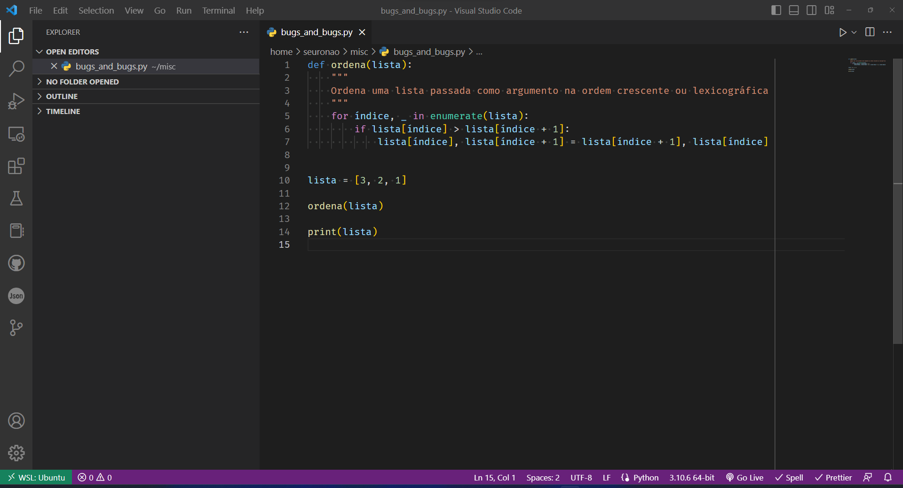
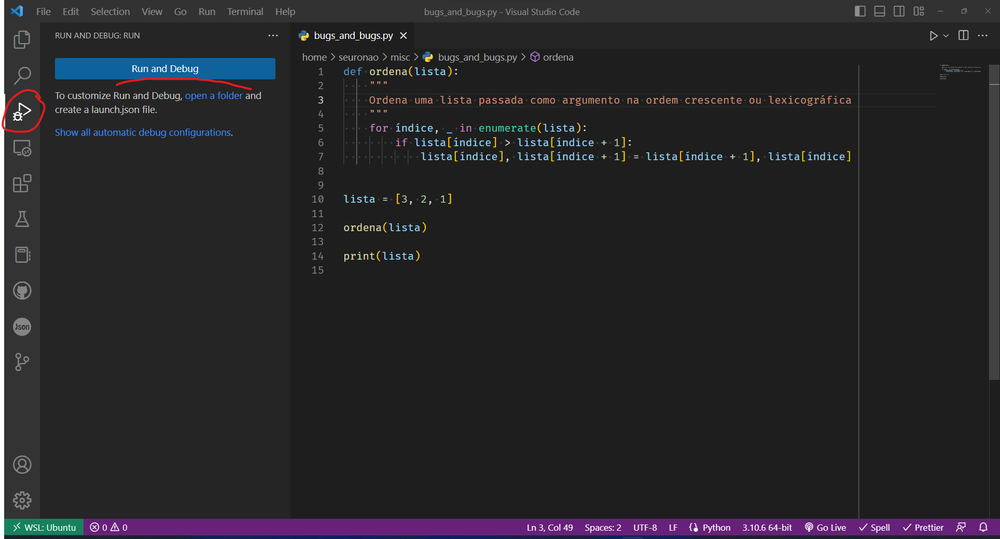
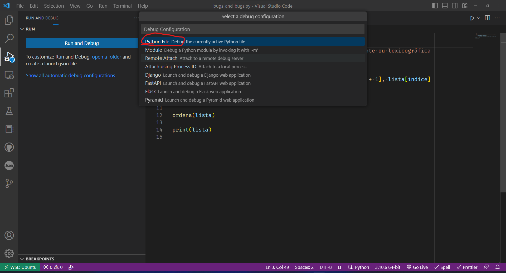
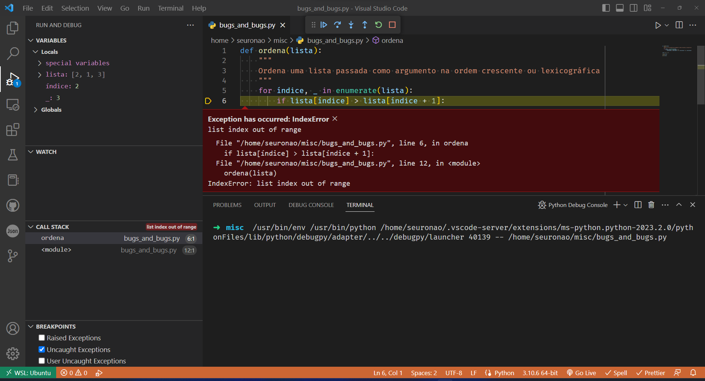

# Debugging

A arte/ciência de encontrar erros em programas e como lidar com eles.

> O seu computador só faz o que você manda; ele não lê a sua mente para fazer o que você pensou que mandou ele fazer.
> Até programadores profissionais criam bugs o tempo todo, então não se sinta desmotivado se seu programa tiver um problema.

## Exceções

Existe o fluxo _"normal"_ de um programa e existem as exceções à esse fluxo.

Quando elaboramos funções, normalmente, temos um uso específico ou uma ação específica para valores específicos dela.

Por exemplo, uma função que calcule a área de um quadrado `area(lado)`

```python
def area(lado):
    return lado * lado
```

Contudo, o que acontece se o usuário chamar `area("2")` o resultado será `'22'`.
E agora?
Podemos tentar ver se o argumento passado é um `int` ou `float` e calcular somente nesse caso.

```python
def area(lado):
    if type(lado) is not int and type(lado) is not float:
        # E se não for?
    return lado * lado
```

Contudo temos um segundo problema, no caso de chamar a função com algo que não seja um `int` ou `float`, o que fazer?
Podemos retornar `-1`, ou podemos retornar `None`.
Se usarmos `-1` como vamos saber se a função executou corretamente, mas o argumento usado foi `-1`.
No caso de `None`, teremos que sempre validar o resultado da função para saber se ela retornou alguma coisa.

```python
variável = area(lado)
if variável is not None:
    # Função rodou direito
```

Se em algum lugar esquecermos de fazer esse `if` podemos ter um novo bug por ter passado como argumento um lado errado.

Além disso, se passarmos um _lado_ negativo, também teremos que tratar isso pois, normalmente, figuras geométricas não tem lados negativos.

```python
def area(lado):
    if type(lado) is not int and type(lado) is not float:
        return None
    if lado < 0:
        return None
    return lado * lado
```

Agora temos um segundo problema, quando `area` retorna `None` pode ser um erro pois o tipo passado como `lado` não foi `int` ou `float` ou o `lado` é um número negativo...

A medida que vamos adicionando restrições teremos mais problemas ainda, fora que o código está ficando cada vez menos legível.

Existe uma forma _mais elegante_ de resolver isso que é usando exceções.

```python
def area(lado):
    tipos = [int, float]
    if type(lado) not in tipos:
        raise TypeError("lado tem que ser int ou float")
    if lado < 0:
        raise ValueError("lado tem que ser maior ou igual à zero")
    return lado * lado
```

Agora se chamarmos `area` com um lado que não é `int` ou `float` ou se chamarmos com `lado < 0` teremos as seguintes mensagens.

```python
>>> area("2")
Traceback (most recent call last):
  File "<stdin>", line 1, in <module>
  File "<stdin>", line 4, in area
TypeError: lado tem que ser int ou float
>>> area(-1)
Traceback (most recent call last):
  File "<stdin>", line 1, in <module>
  File "<stdin>", line 6, in area
ValueError: lado tem que ser maior ou igual à zero
```

Agora as mensagens de erro são claras e sabemos exatamente o que aconteceu em cada caso.

### Try/Except

Considere o seguinte programa, o código pode ser acessado [aqui](area_total.py).

```python
def area(lado):
    tipos = [int, float]
    if type(lado) not in tipos:
        raise TypeError("lado tem que ser int ou float")
    if lado < 0:
        raise ValueError("lado tem que ser maior ou igual à zero")
    return lado * lado


lado = input("Digite o lado do quadrado que deseja calcular a área: ")
lado = float(lado)
area_quadrado = area(lado)

print(f"A área do quadrado é {area_quadrado}")
```

O problema aqui é que se o usuário digita um número que não possa ser convertido para float o programa finaliza com uma mensagem de erro.

Isso, normalmente, é mal visto pelos usuários do programa, deveríamos tratar esse erro e explicar para o usuário qual o problema que está acontecendo de forma mais clara.

Quase ninguém vai entender `ValueError: could not convert string to float: 'a'` se digitar `a`.

Agora usando `try`/`except` podemos tratar os erros de forma um pouco melhor.
Considere o código abaixo, que também pode ser encontrado [aqui](area_try.py).

```python
def area(lado):
    tipos = [int, float]
    if type(lado) not in tipos:
        raise TypeError("lado tem que ser int ou float")
    if lado < 0:
        raise ValueError("lado tem que ser maior ou igual à zero")
    return lado * lado


lado = input("Digite o lado do quadrado que deseja calcular a área: ")
try:
    lado = float(lado)
except ValueError:
    print("Você digitou um valor que não é um número.")
    exit()

try:
    area_quadrado = area(lado)
except TypeError:
    print("area só pode ser calculado com um valor numérico")
    exit()
except ValueError:
    print("o lado de um quadrado não pode ser negativo")
    exit()
except Exception:
    print("algum outro erro desconhecido aconteceu.")
    exit()
else:
    print(f"A área do quadrado é {area_quadrado}")
```

## Debuggers

Um _debugger_ é um programa que pode ser usado para rodar outro programa, passo a passo, exibindo os valores da pilha de execução e variáveis, como também os escopos delas para facilitar encontrar bugs.

Existem vários ambientes de desenvolvimento que tem seus próprios _debuggers_, explicar como funciona cada um deles foge do escopo desse texto.

### Visual Studio Code

No visual studio code, podemos usar o debugger para rodar um programa escrito em Python, um exemplo com explicações pode ser encontrado abaixo.



O programa [bugs_and_bugs](bugs_and_bugs.py) aberto na tela inicial.



O símbolo destacado lança o perfil do debugger.



Como o projeto é um arquivo em Python, o perfil melhor para se rodar ele é usando `Python File`.



Quando o programa é executado a lista de variáveis, a pilha de execução, e todas as informações relevantes podem ser econtradas na tela.
Quando alguma exceção, não tratada, é lançada o debugger para a execução do programa na linha que lançou a exceção.

Explicar como funciona um debugger de forma geral, foge do escopo desse texto, contudo seguem links para um estudo mais aprofundado.

- [Documentação Oficial do Visual Studio Code](https://code.visualstudio.com/docs/editor/debugging) com [Tradução Automática do Google](https://code-visualstudio-com.translate.goog/docs/editor/debugging?_x_tr_sl=en&_x_tr_tl=pt&_x_tr_hl=en&_x_tr_pto=wapp)
- [Documentação Oficial do Visual Studio Code e Python](https://code.visualstudio.com/docs/python/debugging) com [Tradução Automática do Google](https://code-visualstudio-com.translate.goog/docs/python/debugging?_x_tr_sl=en&_x_tr_tl=pt&_x_tr_hl=en&_x_tr_pto=wapp)

## Leitura Recomendada

Leia o restante do capítulo [Debugging](https://automatetheboringstuff.com/2e/chapter11/) existe a tradução automática do google para páginas inteiras como pode ser visto [clicando aqui](https://automatetheboringstuff-com.translate.goog/2e/chapter11/?_x_tr_sl=auto&_x_tr_tl=pt&_x_tr_hl=en&_x_tr_pto=wapp).

## Créditos

Esse texto foi fortemente inspirado no [Automate The Boring Stuff](https://automatetheboringstuff.com/2e/chapter11/) e também está sob a licença [Creative Commons](https://creativecommons.org/licenses/by-nc-sa/3.0/).
